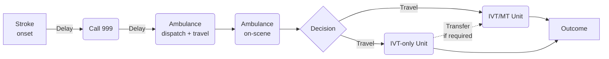

# simpy-pathway-model
Simpy pathway model for stroke thrombolysis and thrombectomy

```mermaid
flowchart LR
    A[Stroke\nonset] --> |Delay| B(Call 999)
    B --> |Delay| C(Ambulance\ndispatch + travel)
    C --> D(Ambulance\non-scene)
    D --> E{Decision}
    E --> |Travel| F(IVT-only Unit)
    E --> |Travel| G(IVT/MT Unit)
    F .-> |Transfer\nif required| G
    G --> H[Outcome]
    F --> H
```

