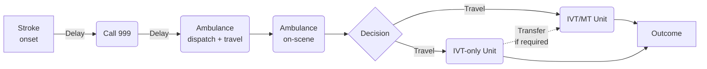

# simpy-pathway-model

Simpy pathway model for stroke thrombolysis and thrombectomy. This models compares the outcome difference between two models of care:

1. Patients attend their closest unit first for thrombolysis, with onward transfer for thrombectomy as required.

2. An assessment is done on scene and decision is made whether to bypass a local thrombolysis-only centre and take the patient further to a combined thrombolysis/thrombectomy centre.

## File structure

### Single run

A single run of the model is made from the `single_run.ipynb` notebook, or `single_test.py`. These load and set up a single `Scenario` object, which holds model pararmeters, loads the `Model` object (passing it the `Scenario` object), and runs the model.

A single run uses four classes (each held in a separate module):

1. `Scenario` (from `scenario.py`) holds data and model parameters. It has default values which may be over-written by passing a dictionary of parameters and their new values.

2. `Patient` (from `patient.py`) stores information about a particular patient as it passess through the clinical pathway. It contains geographic information (such as home location and time to closest stroke units), records times as the patient passes through the pathway, and outcome information. At the end of the pathway key information is transferred to a dictionary held by the `Pathway` object.

3. `Pathway` (from `pathway.py`) contains all the patient pathway steps. The `process_patient` method controls patient flow through each step. The `Pathway` object also stores information for each complete patient.

4. `Model` (from `model.py)` is initiatiated with a `Scenario` object. The `Model` object initialtes SimPy `Environment` and `Pathway` objects. `Patients` are generated in a continual loop (`generate_patient_arrival` method), with a delay between each new patient goeverned by a suitable inter-arrival time. `Patients` are passed to the `Pathway`. At the end of the run results from the `Pathway` are converted to DataFrames and stored in the `Model` object. 