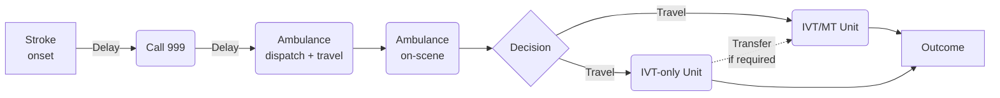

# simpy-pathway-model

Simpy pathway model for stroke thrombolysis and thrombectomy. This models compares the outcome difference between two models of care:

1. Patients attend their closest unit first for thrombolysis, with onward transfer for thrombectomy as required.
2. An assessment is done on scene and decision is made whether to bypass a local thrombolysis-only centre and take the patient further to a combined thrombolysis/thrombectomy centre.

